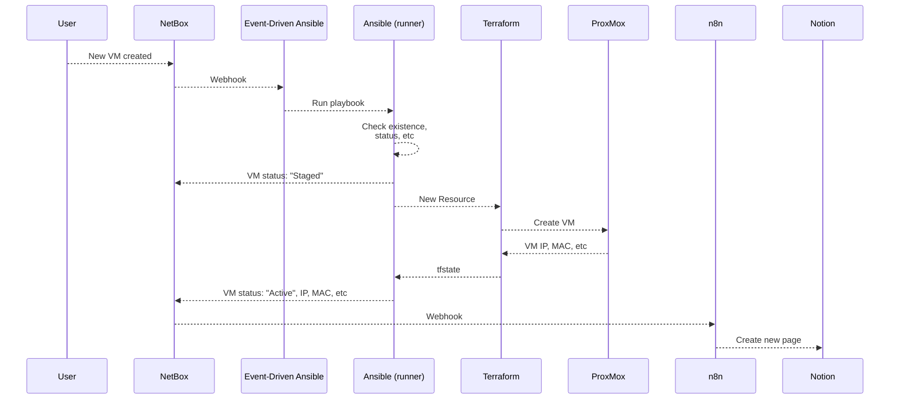
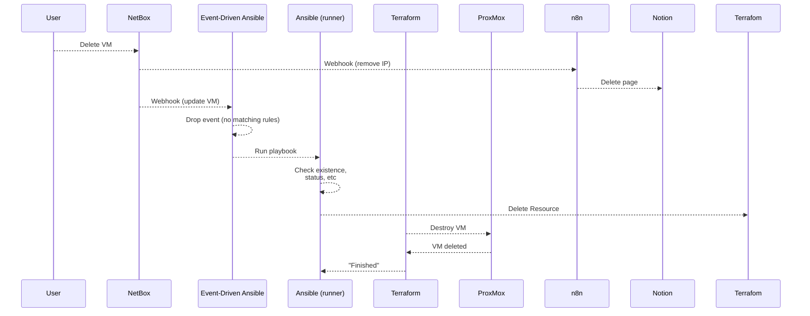

# MAIN
This contains all the working configurations etc for the final project.

## Diagrams
The following diagram shows a typical run of the project. (VM Creation)  

Next, the deletion of a VM.
    

