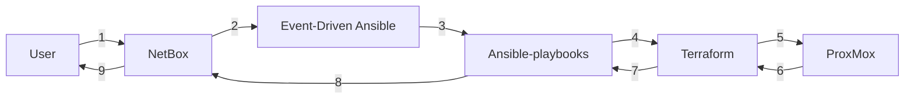
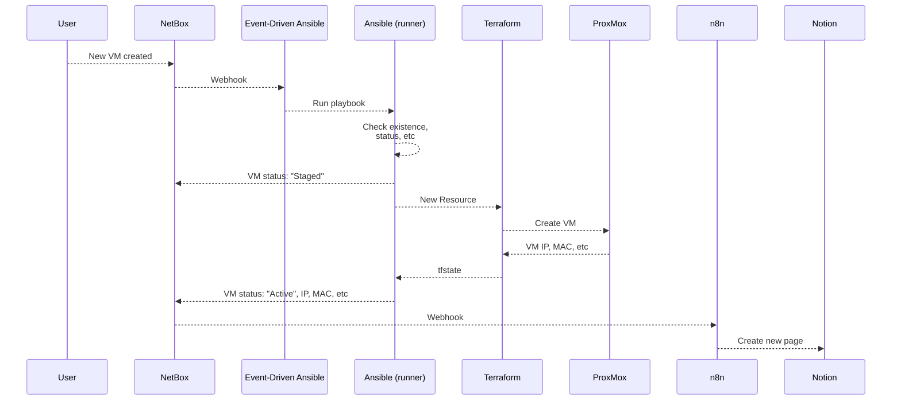
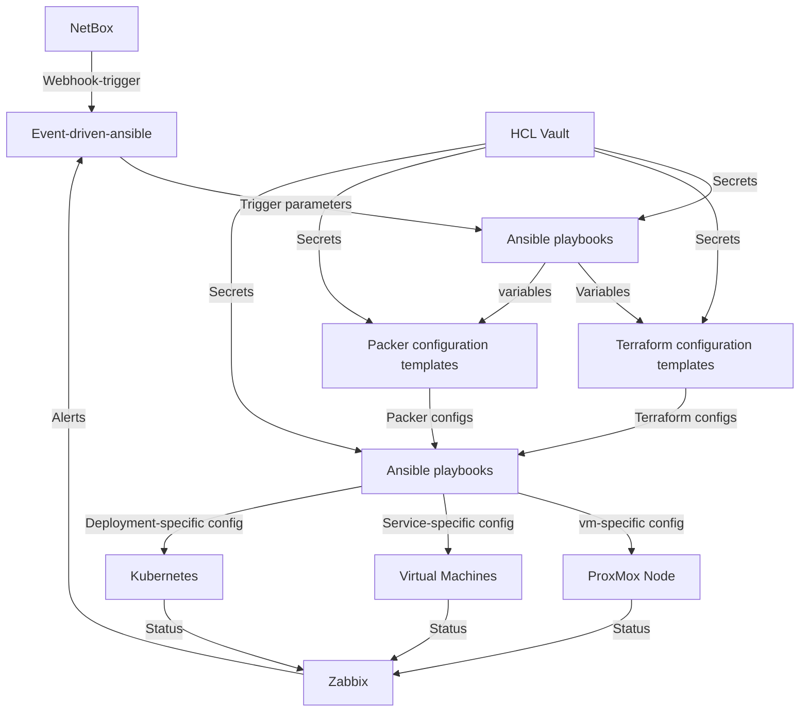
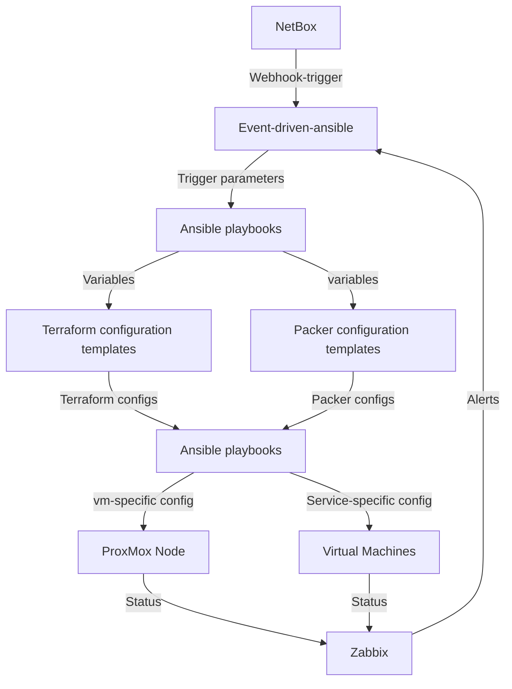

## Louis' eindwerk
## What is this project about?
This repository contains the code and documentation for my end-of-studies project.
The project is about developing (and implementing) an infrastructure automation stack.  
The stack consists of a few different layers and components, they're all linked in a pretty complicated way, the full overview is at the **bottom of this page**  

### Basics
At it's most basic form, the flow is as follows:


Looking at it a bit closer it looks like this:  
**This is a high-level overview, (leaving out some components but it shows the general flow)**  
more flows can be found at [01_main](./01_MAIN/)


## A quick rundown of the different components / layers
- NetBox:  
    NetBox is a DCIM (Data Center Infrastructure Management) and IPAM (IP Address Management) tool.  
    It is used to store information about the infrastructure, and to manage the IP addresses.  
    NetBox is our main source of truth, and is also used to trigger the event-driven-ansible layer.

- Event-driven-ansible:  
    Event-driven-ansible (EDA) is a tool that listens for webhooks from NetBox.  
    When a "event" (or trigger) is received, EDA will check it against a rulebook.  
    If the event matches a specific rule, EDA will initiate a [pipeline](https://github.com/DeclerckLouis/eindwerk/wiki/Pipelines).  
    The rulebook can be used to deploy new infrastructure, or to manage existing infrastructure.
 
- Ansible:
    High-level ansible playbooks are used to generate the required configuration files for Terraform and Packer (and, possibly, lower-level ansible).  
    These ansible playbooks get all their information from the [EDA trigger payload](./concepts_explained/webhooks-and-EDA/), and the [NetBox inventory](./concepts_explained/inventory-plugins/).  

- Packer:
    Packer is used to create the base templates for the virtual machines.  
    These templates are then used by terraform to create the virtual machines in ProxMox.  
    This is implemented to save a lot of time when creating new virtual machines, as the base image is already pre-configured.
    The base image should already contain:
    - A predefined "ansible" user with pubkey auth from the ansible controller
    - the latest updates & security patches
    - the zabbix agent
    - possibly the FreeIPA client

- Terraform:
    Terraform is used to create the virtual machines in ProxMox from the packer templates.  
    The terraform files are actually templates, that are filled in by ansible. (same for the vars.tfvars files)  
    This is implemented to ensure that the infrastructure is always in sync with NetBox.  
    I'm still looking into a way to include the tfstate as a inventory source for Ansible or NetBox. (Not quite sure what the use case would be)  

- Ansible (again):
    Lower-level ansible playbooks are used to configure the virtual machines after they are created.  
    These playbooks are used to configure the virtual machines to the desired state.  
    This can be but is not limited to:
    - Setting up k3s on the hosts
    - Installing specific packages
    - Setting up a LDAP Server
    - Setting up A Chrony server
    - Adding the newly created hosts to Zabbix
    The playbooks are triggered by the EDA system, and should mainly get their information from the NetBox inventory (OR THE TFSTATE FILES).  

- Zabbix:
    Zabbix is used to monitor the infrastructure.  
    Upon deployment of new VM's, the ansible playbook will setup zabbix-agent and add the host to zabbix.  
    Currently, zabbix is doing passive checks, i'm still looking into setting up proxies and might test some active checking later.  
    The monitoring can also be used to trigger the EDA system, this way we can add some basic remidiation to the stack.  


## Requirements
- Python            (tested with Python 3.10.12)
- pip               (tested with pip 22.0.2)
- ansible           (tested with ansible community 9.4)
- terraform         (tested with terraform 1.7.5)
- packer            (tested with packer 1.10.2)
- openjdk           (tested with openjdk-17-jdk)
- ansible-rulebook  (tested with ansible-rulebook 0.1.0)
- ansible-runner    (tested with ansible-runner 2.0.0)
- ansible-lint      (tested with ansible-lint 24.2.1)
- ansible.eda       (tested with ansible.eda 0.1.0) -> ```ansible-galaxy collection install ansible.eda```


## What do i want this project to become?
I want this project to become a fully automated infrastructure stack, that can be used to deploy and manage a complete infrastructure.  
Next up is expanding the stack a little so it's possible to manage kubernetes clusters from the NetBox inventory.  
It would be nice to be able to "declare" a new cluster in proxmox, with the amount of nodes, the IP addresses, etc.  
and then have the stack deploy the cluster, and then deploy kubernetes on top of that.  
if we add the current research of event-driven pipelines, we could even add another layer of self-healing (or self-scaling) to the stack.  
> This would mean that we have double-healing; kubernetes (inherently self-healing) and the cluster nodes (self-healing through the event-driven pipelines).
It's a little extra work, but it would be really nice to have clusters à la carte. (Still, the main use case would be for internal testing and learning)
> Another nice thing that i'm currently working on is centralized secrets management, allowing every component to access only the secrets it needs.  
the new workflow would look something like this:  


## Appendix
### The full overview



## More information
For more information about the different concepts, see the [concepts explained](concepts_explained/) section.  
Please also refer to the [wiki](https://github.com/declercklouis/eindwerk/wiki) for more information about the different used technologies, and how they are implemented in this project.  

> please note: every single thing in this project is subject to change.


